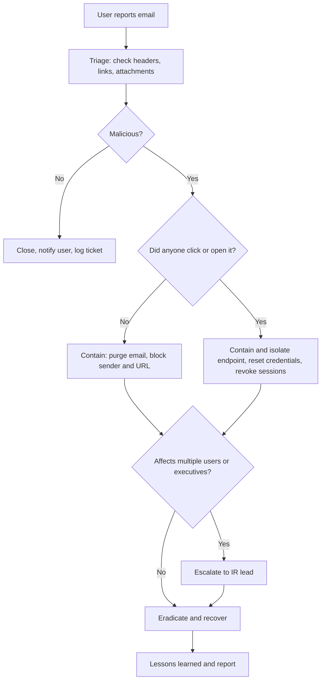

# Phishing Response Flowchart

```mermaid
flowchart TD
    A[User reports email] --> B[Triage: check headers, links, attachments]
    B --> C{Malicious?}
    C -- No --> D[Close, notify user, log ticket]
    C -- Yes --> E{Did anyone click or open it?}
    E -- No --> F[Contain: purge email, block sender and URL]
    E -- Yes --> G[Contain and isolate endpoint, reset credentials, revoke sessions]
    F --> M{Affects multiple users or executives?}
    G --> M
    M -- Yes --> N[Escalate to IR lead]
    M -- No --> H[Eradicate and recover]
    N --> H
    H --> I[Lessons learned and report]
```
